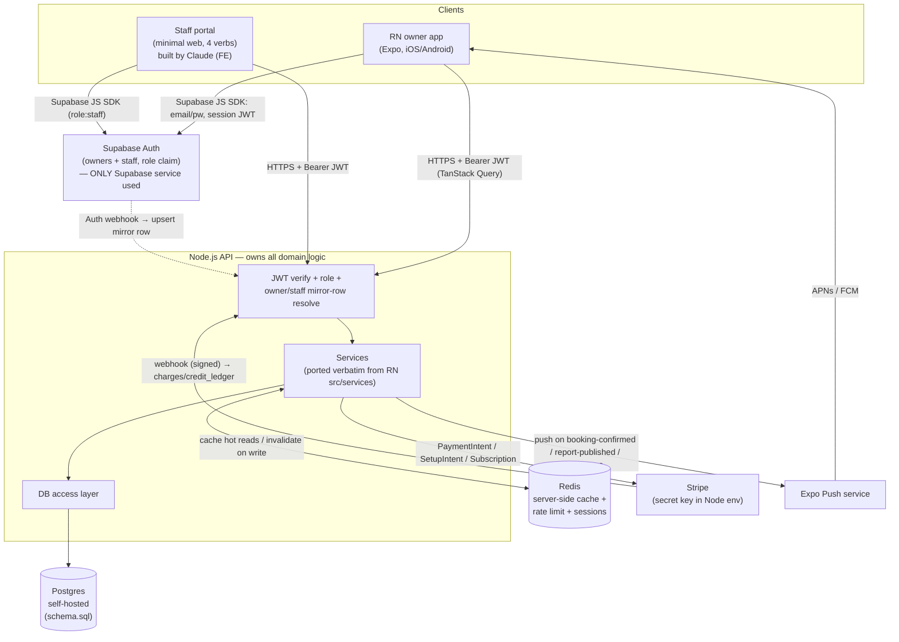

# BACKEND-ARCHITECTURE.md — Phase 3 system design

Locked 2026-05-18. Companion to `.claude/backend/schema.sql` (the DB) and
`.claude/backend/DATA-CONTRACT.md` (the API surface + decision register). This file is
the *why* and the *how it connects* — read it first. The complete standalone visual set (rendered topology, full ERD, auth sequence, transaction flows) is `.claude/backend/DIAGRAMS.md`.

Stack recap (full rationale in ARCHITECTURE.md "Phase 3 backend stack"):
RN app + minimal staff portal → **Supabase Auth only** → **Node.js API** →
**self-hosted Postgres** + **server-side Redis** + **Stripe** (secret key in
Node). No Supabase DB/RLS/Edge Functions/Realtime. Authorization is Node
middleware, not Postgres RLS.

---

## 1. System topology — how everything connects



**Read it as:** the only thing Supabase does is issue a session JWT. Both
clients send that JWT as a Bearer token to the Node API. Node verifies it,
resolves it to an `owners` or `staff` row (the mirror-row seam — created by an
Auth webhook or first-request upsert), enforces the role, then runs the same
domain services the RN app runs today (ported from `src/services`). Postgres is
the system of record; Redis is a read-through cache + rate-limit store; Stripe
is reached only from Node and reports back via signed webhook; push goes out
through Expo.

## 2. Auth + request flow (the load-bearing seam)

1. Client authenticates with Supabase (email/password). Supabase returns a
   session JWT containing the `sub` (Supabase UID) and a `role` claim
   (`owner` default, `staff` for portal users).
2. Every API request carries `Authorization: Bearer <jwt>`.
3. Node middleware verifies the JWT signature against Supabase's JWKS
   (Day-0 lock #2; asymmetric ES256/RS256/EdDSA, HS\* deliberately blocked to
   shut off the alg-confusion attack), extracts `sub`. Day-2 outcome: `kind`
   is *table-derived*, not claim-derived — the verified `sub` is looked up in
   `owners`/`staff` and whichever holds the live row decides owner vs staff
   (no Supabase access-token hook needed).
4. Middleware **resolves only** (Day-2 locked model): `sub` → live
   `owners.supabase_uid` or `staff.supabase_uid`, or 403 `not_provisioned`.
   It never mints rows from a bare token — the NOT-NULL identity columns
   can't be satisfied from a JWT alone. Creation is the webhook's job (5b).
5. **Authorization is explicit app code, per route:** an owner may only touch
   rows reachable from their `owners.id`; ownership flows through
   `dogs.owner_id` and the denormalized `owner_id` on `bookings`/`threads`/
   `pending_requests`. Staff routes require `role = staff`. There is no RLS —
   this middleware *is* the access-control layer (the deliberate design).
5b. **Provisioning** runs only via `POST /auth/webhook` `[public, signed]` —
    Supabase "user created" → upsert mirror row (`ON CONFLICT(supabase_uid)`
    clears `expired_at`, so re-invite re-links a soft-expired account, never
    re-INSERTs). The webhook validates invite metadata at the boundary; a
    payload that can't satisfy the row's NOT NULLs is rejected 422 with the
    exact missing fields. Webhook actor = `system:auth-webhook` (the first
    non-user actor — exactly why `withActor` takes a string).
6. Account model is **invite/pre-provisioned** (v1): owners are seeded for
   Shanthi's ~100 known clients; there is no open public signup endpoint. The
   app's "signup" screens become accept-invite / first-login.
7. **The `app.actor` per-txn primitive** (`withActor(actor, fn)` in
   `src/db/tx.ts`): opens a Drizzle transaction and, as its first
   statement, runs `set_config('app.actor', actor, true)` —
   `is_local = true` scopes the GUC to that transaction (which is exactly
   why Day-0 lock #3 mandates the direct/session connection, never the txn
   pooler). Every audited write composes this; `audit_capture` reads
   `current_setting('app.actor', true)` and the prior row is preserved with
   the right actor. Day-2 outcome: the `audit_capture` trigger was
   behaviorally validated for the first time end-to-end (HANDOFF §6
   structurally-but-not-behaviorally caveat is closed for `owners` UPDATE;
   the same chain covers every other audited table by construction).

## 3. Caching (Redis) — what, and invalidation

Redis is **server-side only** — complementary to the FE's TanStack Query
client cache, never a substitute for it. Cache the expensive, cross-user,
read-mostly things; invalidate on the write that changes them:

| Cached | Key | Invalidated by |
|---|---|---|
| Day capacity / availability for a date | `avail:{date}:{mode}` | capacity override write; nightly TTL |
| Group classes + cohort fill | `cohorts:{classKey}` | enroll txn; `bumpFilled` |
| Per-dog credit balance | `credits:{dogId}:{mode}` | any `credit_ledger` insert for that dog |
| Announcements feed | `ann:{location}` | announcement publish |
| Dog-profile read bundle | `dogprofile:{dogId}` | report publish / booking change for that dog |

Rule: cache invalidation is the writing service's responsibility, in the same
transaction boundary's `onSettled` step — never a separate cron reconcile.
Rate-limit counters + any short-lived server session state also live in Redis.

## 4. Entity-relationship diagram

```mermaid
erDiagram
  owners ||--o{ dogs : owns
  owners ||--o{ bookings : "owns (denorm)"
  owners ||--o{ pending_requests : submits
  owners ||--o{ threads : participates
  owners ||--o{ payment_methods : has
  owners ||--o{ charges : billed
  owners ||--o{ memberships : subscribes
  owners ||--o{ notifications : receives
  owners ||--o| stripe_customers : maps
  owners ||--o{ device_tokens : registers

  staff ||--o{ reports : authors
  staff ||--o{ bookings : "trains (optional)"
  staff ||--o{ pending_requests : approves

  dogs ||--o{ dog_vaccines : has
  dogs ||--o{ dog_medications : has
  dogs ||--o| dog_feeding : has
  dogs ||--o{ dog_completed_classes : completed
  dogs ||--o{ booking_dogs : "on"
  dogs ||--o{ pending_request_dogs : "on"
  dogs ||--o{ reports : about
  dogs ||--o{ credit_ledger : "credits for"

  bookings ||--o{ booking_dogs : includes
  bookings }o--o| reports : "report_id (1:1 session)"
  bookings }o--o| reports : "session_report_id (cohort)"
  bookings }o--o| cohorts : "group-class rows"

  pending_requests ||--o{ pending_request_dogs : includes
  pending_requests ||--o{ pending_request_preferred_dates : ranks
  pending_requests }o--o| bookings : "converted_booking_id"

  group_classes ||--o{ cohorts : runs
  group_classes ||--o| group_classes : "prereq_class_key"

  credit_packages ||--o{ credit_ledger : grants
  charges ||--o{ credit_ledger : "funds (purchase)"
  charges }o--o| bookings : "pays for (payg)"

  threads ||--o{ thread_dogs : about
  threads ||--o{ messages : contains

  events ||--o{ event_rsvps : has
  event_rsvps ||--o{ event_rsvp_dogs : includes

  notifications ||--o{ notification_dogs : about
```



## 5. What the production design fixes vs. the mock layer

The repository-extraction pass found 14 mock-layer behaviors. The ones the
schema/transaction design deliberately corrects:

| Mock gotcha | Production fix |
|---|---|
| `enrollInGroupClass` = 2 non-transactional writes | one txn: row-lock cohort → capacity assert → N×M inserts → fill bump |
| No cohort capacity enforcement anywhere | `cohorts.filled <= capacity` CHECK + `SELECT … FOR UPDATE` |
| Report join is `(dogId,category,sameDay)` first-match, lossy | explicit `bookings.report_id` / `session_report_id` FK |
| Client-minted `req-local-${Date.now()}` ids collide | server `gen_random_uuid()` |
| Prereq eligibility = client-trusted `completed_class_keys` | server-derived from `dog_completed_classes` (R7) |
| Credits = mutable counter | append-only `credit_ledger` + balance view |
| `unread_count` mutated in place, drifts | derived from `messages.read_at IS NULL` |
| `notes` flat string, `joint` channel unreachable | structured `notes_per_dog` / `notes_joint` (R1) |
| anchor-relative date shifting | absolute `timestamptz`; shifting was mock-only (R5) |

## 6. Phase-3 sequencing (unchanged by this doc)

> **Step 4 is expanded day-by-day in `.claude/backend/IMPLEMENTATION.md`** —
> the uniform per-day plan (one reviewable day per thread, commit + handoff
> each day). That is the working execution doc; this list stays the macro view.

1. **Contract freeze (#1)** — this doc + `schema.sql` + `DATA-CONTRACT.md`. ← here
2. On-device verification debt (TestFlight walkthrough + Maestro CLI).
3. FE → TanStack Query **against the existing mock repositories** (decouple
   "adopt server-state caching" from "swap data source").
4. Stand up Node API + Postgres (`schema.sql`) + Redis; implement endpoints to
   `DATA-CONTRACT.md`.
5. Rewrite `src/repositories/*` to call the Node API. Services/hooks/screens
   unchanged (the whole point of the repository seam).
6. Supabase Auth wiring; invite/seed the ~100 owners; staff rows.
7. Build the minimal staff portal (FE, Claude) against the same contract.
8. Flip `payments_enabled` on once the core loop is proven.

## Stand-up decisions (LOCKED — Day 0, 2026-05-19)

1. **ORM → Drizzle**, as a typed query builder *over* the frozen `schema.sql`;
   the ORM **never owns migrations**. The schema is hand-hardened DDL
   (`audit_capture` + 3 booking-gate triggers + `touch_updated_at`, partial
   unique indexes, the `capacity_exempt` generated column, composite-subtype
   FKs, CHECKs, `COMMENT ON`); Prisma's schema language + migration engine
   can't model that. Drizzle is SQL-first: introspect/hand-map, query only.
   *Day-1 outcome:* `drizzle-kit pull` modeled all 45 tables (incl. the
   `capacity_exempt` generated column + enum-array columns) — no whole-table
   hand-mapping needed. It has deterministic codegen defects on this schema
   (mangled empty-string / empty enum-array defaults; extensionless relations
   import) repaired by `scripts/fix-introspection.mjs`, wired into
   `npm run db:introspect` with a fail-loud assertion. Generated `default()`
   values are not authoritative (never generate DDL); `schema.sql` is.
2. **JWT verify → JWKS endpoint**, keys cached (Redis or in-memory).
   Asymmetric, no shared secret to leak or hand-rotate; verify
   sig/exp/aud/iss against Supabase's published JWKS.
3. **Postgres hosting → managed: Supabase's bundled Postgres**, same project
   as Supabase Auth. The API owns *all* data access — Drizzle over a `pg`
   pool on the Postgres connection string with a privileged app role. **No
   PostgREST, no Supabase client SDK for data, no RLS** (authz is in the API
   layer per §2). Supabase is the managed host + auth provider only. Refines
   the original "Supabase Auth ONLY + separate SQL" lean: the SQL *is*
   Supabase's Postgres; the separation is logical (API-owned), not a
   different host. Hosting-agnostic schema keeps this reversible. *Day-1
   TLS:* Supabase's direct connection presents a Supabase-CA-signed cert
   (not in Node's trust store). Resolved with **CA-verified TLS** —
   `ssl: { ca: <supabase root CA>, rejectUnauthorized: true }` via the
   `DATABASE_SSL_CA` env (cert committed at `certs/supabase-ca.crt`,
   it is public) — **never `rejectUnauthorized:false`**. `DATABASE_URL`
   carries no `?sslmode=` (TLS is code-driven). Use the **direct or session**
   connection (5432), never the transaction pooler (6543) — Day-2
   `SET LOCAL app.actor` needs session scope.
4. **Framework → Fastify + Zod.** Schema-validated routes match "validate at
   every trust boundary"; Zod doubles as the runtime validator for the frozen
   §B wire shapes; faster than Express.
5. **Migrations → raw SQL, `schema.sql` canonical.** No tool re-derives the
   hardened DDL. DEV-RESET is the commented `DROP SCHEMA` preamble at the top
   of `schema.sql` (not a separate file — `reset.sql` was deleted). CI loads
   `schema.sql` into a fresh empty DB and asserts the preamble stays
   commented.

Photo storage (Supabase Storage vs. S3/R2 vs. self-hosted) is **not** a Day-0
gate — it is decided at Day 17 (Media). None of the above blocked the
contract; none change the frozen `schema.sql` / `DATA-CONTRACT.md`.

## Worker tx-scope patterns (locked, Day-17 2026-05-27)

The codebase ships two distinct tx-scope patterns for worker functions
(`runXxxOnce(opts) → result` instances composed into the scheduler tick).
Both are correct; the choice is driven by **whether the per-row work is
IO-bound or CPU-bound** — which dictates how long it's reasonable to hold
a `pg` pool connection open.

### Pattern A — **all-in-tx** (current Day-15 + Day-16 workers)

Used by `runInvoiceAutoChargeOnce` (Day-15 — Stripe payment-intent calls
for invoice dunning) and `runScheduledNotificationsTick` (Day-16 — claim
+ INSERT notifications + per-row device-token lookups).

```
withActor(actor, async (tx) => {
  const batch = await repo.lockDueForRun(tx, ...);   // FOR UPDATE SKIP LOCKED
  for (const row of batch) {
    const result = await callExternal(...);          // Stripe / Expo / etc.
    await repo.settle(tx, row.id, result);
  }
});  // ← tx commits HERE; row locks release; out-of-tx push dispatch
```

One Postgres tx wraps the entire batch. The `FOR UPDATE SKIP LOCKED`
claim locks the rows for **this connection** until commit, so concurrent
workers never double-claim. External-API calls happen INSIDE the tx for
Stripe (Day-15 — synchronous Stripe path because we need the
PI status to settle the invoice in the same row) and JUST AFTER the tx
for Expo (Day-16 — DB is source of truth, push is best-effort).

**Cost**: an IO-bound call inside the tx (Stripe ~200-500ms p99) holds a
pg connection that long. At a pool size of 10 and Stripe at p99,
~20 concurrent batches saturates the pool.

**OK when**: the per-row external work is IO-bound (network), latency is
predictable, batches are small (≤50 rows), and the simpler shape is
worth more than the connection-pool headroom.

### Pattern B — **3-tx-scope** (Day-17 media-derivatives worker)

Used by `runMediaDerivativesOnce` (Day-17 — sharp image processing).
Introduced because sharp is **CPU-bound** (libvips native; ~200-500ms
per resize × 3 sizes per asset = 1-2s on the worker process). Holding a
pg connection through that latency under any meaningful concurrency
would starve the pool faster than the IO-bound Pattern A workers.

```
// Phase 1 — claim-tx (fast)
await withActor(actor, async (tx) => {
  claimed = await repo.lockDueForRun(tx, ...);     // FOR UPDATE SKIP LOCKED
                                                   //   + UPDATE status='processing'
});  // ← tx commits FAST; pg connection released

// Phase 2 — per-job, OUT OF TX (slow CPU work)
for (const job of claimed) {
  const result = await processOne(job);            // sharp, R2 IO, etc.

  // Phase 3 — settle-tx (fast, per-job)
  await withActor(actor, async (tx) => {
    await targetRepo.applyResult(tx, job, result);
    await repo.markDone(tx, job.id);
  });
}
```

The claim-tx flips `status='pending' → 'processing'` atomically (one
SELECT-FOR-UPDATE-SKIP-LOCKED followed by an UPDATE WHERE id IN (...))
and commits immediately — the row is now reserved by `status`, not by
a held lock. Subsequent ticks filter on `status='pending'` and skip the
in-flight rows. The settle-tx per job applies the result + marks done
(or marks failed with `last_error` captured).

**Cost**: a worker crash between Phase 2 and Phase 3 leaves the row
stuck at `'processing'` forever. Recovery is a Day-20 sweep that
finds `status='processing' AND updated_at < now() - timeout` and
flips them back to `'pending'`.

**Required when**: per-row work is CPU-bound (image/video processing,
report PDF generation) OR the external API has long-tail latency that
would correlate with pool exhaustion (multi-minute uploads, batch
analytics calls).

### Choice rule

- **External-API IO, predictable latency, simpler is better** →
  Pattern A. Day-15 invoice dunning + Day-16 scheduled notifications.
- **CPU-bound work OR long-tail latency** → Pattern B. Day-17 media
  derivatives.

### Day-20 follow-up (flagged here, not in this doc's commit)

The Day-15 + Day-16 workers use Pattern A today. **Day-20 scale-out
hardening should consider refactoring them to Pattern B** to remove
the pool-exhaustion ceiling, since the same justification applies
(Stripe + Expo are both IO-bound with long-tail latency under load).
The decision is "do it when measurement says we need to" — not a
blanket refactor. Pattern B is the better long-term shape but Pattern
A's simplicity is genuinely valuable at today's traffic.

### Shared invariants across both patterns

1. **Worker actor** — every write is stamped with `withActor(actor, ...)`
   so the `audit_log` reflects "this row changed because the scheduler
   ran" vs. an owner mutation. Day-15 + Day-17's media worker both run
   under `system:scheduler`; Day-15's invoice tick inherits
   `system:stripe-webhook` (it reconciles Stripe-side state). The actor
   string is the audit-lineage key.
2. **Per-tick batch cap** — every worker takes a `limit` opt so one tick
   can't stretch to minutes. Day-16: 50 (notifications). Day-15: 50
   (invoices). Day-17: 5 (derivatives — sharp's 200-500ms multiplies).
3. **DB is source of truth** — external API failures (push transport,
   sharp throws) NEVER block the DB settle. Day-16 logs-and-swallows
   the Expo failure; Day-17 marks the job `'failed'` with the captured
   error and the source row stays usable. Reading the DB tells you
   what happened, even when the third party is having a bad day.
4. **`runXxxOnce(opts) → result`** — every worker is a pure function of
   its opts. Tests call it directly with a fixed `now`. Production
   composes them into the scheduler tick called by pg_cron + pg_net.
5. **Compose, don't proliferate** — one `POST /workers/tick` entrypoint
   composes every phase. New workers add a phase to
   `runSchedulerTickOnce`, not a new HTTP endpoint.

## Money + contract patterns (locked, 2026-06-22)

Landed with the credit-expiry P2/P3 lane, the double-settle hardening, and the
#5 contract single-source. Four reusable patterns.

### Unified invoice settlement — `settleInvoiceCharge` + refund-the-loser

Both settle paths (the auto-charge worker and the owner-initiated `POST
/invoices/:id/pay`) route through ONE primitive, `src/lib/settleInvoiceCharge.ts`.
The atomic claim is a conditional `markPaid` — `UPDATE invoices SET status='paid'
WHERE id=? AND status='open' RETURNING id` — so under concurrency exactly one
caller's UPDATE matches a row; the loser sees 0 rows. The Stripe PaymentIntent is
created BEFORE the DB tx, so a naive "rollback when the claim loses" would orphan
a real charge. Instead the **loser refunds its OWN PI** (refund-the-loser,
mirroring `cancelBookingService`). Deliberately NO `'settling'` invoice status was
added — less enum surface to misread. Accepted trade: a genuine race briefly
double-charges at Stripe then refunds (the customer may see a transient charge
reverse). Residual, pre-existing and out of this lane: a refund whose Stripe call
itself fails has no retry sweeper (flagged for a future pending-refund worker).

### Per-location settings — org-default + override (`credit_expiry_settings`)

One table holds an org-default row (`location IS NULL`) plus per-location override
rows. Two PARTIAL unique indexes enforce the invariant: one org-default
(`UNIQUE ((location IS NULL)) WHERE location IS NULL`) and one row per slug
(`UNIQUE (location) WHERE location IS NOT NULL`). Resolution is total: override >
org-default > code default (`resolveExpiryWindowMonths` `?? DEFAULT_…`), so a
missing row can never yield `undefined`/`NaN`. This is the reusable shape for any
future per-location tunable (cancel window, rates already do similar).

### `payment-failed` → scheduled-notifications push routing

A parked invoice's `payment-failed` notification routes through
`scheduled_notifications` (the generic push channel; `deliverOne` is type-agnostic)
so it lands as feed **+ push**. `payment-succeeded` stays feed-only — a receipt
shouldn't interrupt. Dedupe is `dedupe_key='payment-failed:<invoiceId>'` (a column
`UNIQUE` + `ON CONFLICT DO NOTHING`) → exactly one push per parked invoice. Trade:
the feed entry now lands on the NEXT scheduler tick (carrying the push) instead of
instantly — same deferral the `credits-expiring` scan accepts.

### Shared wire contract single-source + compile-time conformance (#5)

`src/contracts/wire.ts` single-sources every shared API↔portal wire type. It
is **dependency-free by construction** — zero imports, enum unions declared as
string literals — so it is browser-safe and can be copied verbatim into the portal
bundle without dragging in Drizzle/server code. `src/contracts/conformance.ts`
(API-only) ties each literal union to its Drizzle `pgEnum` via `Expect<Equal<…>>`
type-asserts; drift between a wire literal and its DB enum is a COMPILE failure
(proven load-bearing — dropping an enum member breaks `tsc` at the assert line).
It does NOT rewire `pgEnum` (`schema.ts` is introspection-generated). The portal's
`src/api/contracts.ts` is GENERATED from `wire.ts` by `npm run sync:contracts`;
`npm run check:contracts` is the drift guard — env-gated so a missing source
SKIPS locally (independent builds) but HARD-FAILS under `FETCHD_REQUIRE_WIRE=1`
(CI), and wired into the portal's `pretest` hook so `npm test` enforces sync.
Single api consumers of a shared concept import from `wire.ts` (e.g.
`staffReports` uses `isSessionProgram`) so the single source is live-consumed —
never a parallel copy that can silently diverge.

## Observability + paging seam (LOCKED — Day-20a, 2026-08-25)

### The decision: tap the log, don't reroute it

`src/lib/observability.ts` is the one place this API knows how to tell a
**human** something went wrong. It exists because on 2026-08-24 the money
alarms were proven to PRINT and proven to reach nobody: a scheduler tick
refunded 12000c of an owner's money and the only artifact was a line in a log
stream no one watches.

**What shape it actually is** (corrected 2026-08-25, D20-A3 §A3.4.5 — the
first version of this section claimed the `lib/expoPush.ts` / `lib/r2.ts`
pattern, and that was half-true). Those modules export `interface +
defaultXClient` and inject **per call site**: no init step, no mutable module
state. This one is a **lazily initialised module singleton**, nearer
`redis.ts`: a mutable `let` plus an imperative `initObservability()`. That is a
genuinely different shape and it was chosen for a reason — alarms are raised
from FOUR layers (routes, workers, the `mutation.ts` seam, process crash
handlers) and threading a transport through all of them would mean editing
every one, including the money workers that closed CLEAN and stay closed.

What carries over from the locked pattern is the part that matters for
substitution: `AlarmTransport.send` is the only outbound surface, the default
impl is one function, and tests inject a stub. `captureAlarm` is
fire-and-forget and **never throws**.

The hazard that shape creates — init never called ⇒ a silent no-op, which is
round 6's `?? NOOP_LOG` defect one layer up — is closed rather than tolerated:
`buildApp()` throws in production when `isPagerInstalled()` is false,
`GET /health/watchdog` reports the same fact to an external monitor, and a
subprocess test boots the real `src/index.ts` against a local ingest listener
and asserts an envelope arrives.

Two properties are load-bearing and each is pinned by a red-first test:

1. **Additive, never a reroute.** Round 6 established the request logger AS
   the alarm channel and made deleting the wire-up a compile error
   (`routes/workersTick.ts`). Day-20a does not move that channel; it taps it.
   `server.ts` passes `hooks: alarmForwardingHooks()` to Fastify's logger, the
   hook forwards every call at pino level ≥ 50 and then calls
   `method.apply(this, args)` unchanged. Child loggers inherit hooks —
   verified against the installed pino 10.3.1 at runtime, not from docs — and
   `request.log` is a child, so **every** worker alarm, phase-boundary
   swallow, and 500-mapper line pages without a single edit under
   `src/workers/`. The money workers closed CLEAN in prior cycles; reopening
   them to add per-site Sentry calls would have been the rejected design.
2. **Observability never takes down the observed system.** The hook body is
   try/catch-wrapped and `captureAlarm` swallows independently, because a
   throwing hook breaks ALL logging for every request — the one way this seam
   could hurt the app. A transport failure writes one stderr line and is
   otherwise dropped; the send carries a 5s `AbortSignal.timeout`. **The log
   is the record; Sentry is the pager. Neither replaces the other.**
3. **Suppression is de-duplication, never rationing** (LOCKED, D20-A4). One
   invariant, stated in one sentence because that is the test of whether it is
   right: ***the pager never withholds an event unless it has already sent an
   identical one recently.*** Two earlier versions of this file described a
   token bucket instead — a scarcity gate on the money path, with reasoning
   about which alarms could afford it — and both were inverted from how the
   alarm sources actually work. `captureReconciler.ts:649`'s LOST HOLD
   sentence is a CONSTANT with the identity in its merge object, so N distinct
   lost holds were ONE fingerprint sharing one budget (executed: 12 in, 5
   paged, 7 permanently unpaged, because the source marks a charge alarmed
   BEFORE the log call and never retries). Meanwhile the noisy source templates
   counts into its sentence and minted a FRESH fingerprint every tick, starving
   the global ceiling that was supposed to protect the money alarms.

   What is here now: fingerprint = `logger` + the message with digits
   normalised + `extra`'s identifying scalars left UN-normalised (so `ch_1` and
   `ch_2` are different money) + **any nested `Error`'s class and its
   digit-normalised message** (D20-A5.1) minus per-request keys, each entry
   framed as its own JSON array so a delimiter inside the data cannot forge a
   collision (D20-A5.5 H). The `Error` contribution is not a refinement: it was
   the whole 5xx surface. `auth/plugin.ts:212` logs the constant sentence
   `'unhandled error'` with the fault nested under `err`, nested objects were
   ignored, and six genuinely distinct first-ever 500s produced THREE pages
   (executed). The bias is deliberately toward over-uniqueness — extra quota
   use is recoverable, a dropped money alarm is not — and the residue is stated
   rather than claimed away: two events differing only inside a nested
   NON-`Error` object still collapse.

   Three identical events per ten-minute window page; the rest are counted and
   reported when the window rolls. **"Already sent" means DELIVERED** (D20-A5.3):
   the allowance is spent on the transport's success path, because counting at
   admission let three REJECTED sends burn it and withhold the fourth copy of an
   alarm no human had ever seen. The accepted cost is that identical alarms
   raised inside one transport round trip are all admitted — more sending, never
   less, bounded by the breaker and the in-flight ceiling. A first-ever event of
   any fingerprint is never withheld, `level: 'fatal'` bypasses every gate, and
   the only global limit is a CIRCUIT BREAKER (1000 events/hour, far above any
   legitimate volume) that trips loudly and 503s the watchdog rather than
   rationing quietly. `MAX_IN_FLIGHT = 256` remains a true concurrency bound on
   memory, with its drops counted and watchdog-visible.

**Rejected: `@sentry/node`.** v8+ auto-instruments HTTP via OpenTelemetry —
monkey-patching every request path of a system whose money paths just closed
CLEAN — and "the SDK doesn't interfere" is not a claim our gate can evaluate.
The default transport is instead ~60 lines of hand-rolled Sentry envelope POST
(DSN parse → `X-Sentry-Auth` → three NDJSON lines → global `fetch`), the only
place the Sentry wire format exists in this repo, and pinned by one unit test.
Cost accepted: no built-in retry or buffer. Adopting the SDK later is replacing
one default impl behind an unchanged interface.

### Env-selection: host-injected in staging/prod (RATIFIED, the Day-4b deferral)

Opened Day 1, decided Day 4b, implemented in `env.ts`, and deferred for
ratification "in ARCHITECTURE.md or at Day 20" (`IMPLEMENTATION.md`, Day-4b).
**Ratified here as implemented:** host-injected env is the sole source of truth
in `staging` and `production`; `dotenv` loads `.env.local` then `.env` only
outside those two.

What earned the ratification rather than merely permitting it: a stray `.env`
in a deployed container cannot shadow host config (defense against a real ops
mistake, not a hypothetical), and the Day-20a production boot guards below are
only meaningful if production configuration comes from ONE place a person can
read in a dashboard. Process env still trumps both files in dev; the first
file loaded wins per-key, since `dotenv` never overrides an existing value.

### The two production boot refusals

`env.ts` already refused to half-boot on a missing `DATABASE_URL`. Day-20a
extends the same rule to the pager, because both describe a process that would
run happily while being unable to do its job:

- **`NODE_ENV=production` requires `SENTRY_DSN`.** A production API with no
  pager is the `?? NOOP_LOG` silent no-op relocated to the config layer, where
  it can be refused instead of discovered after the money moves. Optional in
  dev/test/staging — staging has no paging duty, and requiring it there would
  add friction with no invariant behind it.
- **`NODE_ENV=production` refuses `LOG_LEVEL=fatal`.** pino does not invoke
  the `logMethod` hook for calls suppressed below the active level, so `fatal`
  silently kills error-level paging while every health check stays green.
  Demotion-by-config — the sibling of the demotion-by-code closed in round 6.

Both messages name the reason, so the next person cannot "fix" the refusal by
setting a dummy value and reinventing the failure it prevents.

The third demotion is Fastify's **per-route `logLevel`**, which silences one
route's logger independently of `LOG_LEVEL` (executed: `app.route({ logLevel:
'fatal' })` and the tap sees nothing on that route). A global env guard cannot
see a per-route option, so until D20-A5.5 the defence was a comment asserting
that no route sets it — an ABSENCE established by a search, which this repo has
ruled a search cannot establish. It is now an `onRoute` hook in `buildApp()`
that THROWS on any route carrying `logLevel`: every route on the app or any
child of it passes through it, at build time for the root instance and at
`ready()` for an encapsulated plugin. If a route ever genuinely needs it, the
thing being changed is the alarm channel, and the build says so.

### `GET /health/watchdog` — the instrument that outlives the others (LOCKED)

`GET /health` answers "is this process up". It cannot answer the question
Allison's 2026-08-24 finding actually asked, which was not *"the cron is
missing"* but ***"production ticks have NEVER fired and nobody knew."*** Every
way the tick can stop — secret drift (the 401 never reaches the app), a wrong
URL (a 404 the process never sees), a deactivated `cron.job` row, a dropped
extension, a paused project — produces zero alarms, because the alarm channel
lives inside a process nothing is calling. One level out, the pager has the
same blind spot: after boot, a transport failure is a stderr line read by
nobody, and the boot smoke proves the channel once, at setup, and never again.

So `POST /workers/tick` writes a Redis heartbeat (`scheduler:last_tick_at`,
24h TTL) immediately after its completion log line — a write that is logged and
swallowed, because a watchdog must never be able to fail the thing it watches —
and `GET /health/watchdog` `[public]` reports `last_tick_at`, `staleness_s`,
pager health, and a `reasons` array. **503** when the last tick is older than
10 minutes; when the heartbeat is ABSENT, UNPARSEABLE, UNREADABLE, or dated in
the FUTURE (each its own reason — a corrupt key must not report "the scheduler
never ran", "I cannot see the key" must not report either, and a forward clock
jump must not buy a dead scheduler that much silence); when the pager has failed
3 sends in a row; when it has LOST 3 sends to failed delivery in the last hour,
consecutive or not; when it has dropped 200 alarms in the last hour; when its
circuit breaker is tripped; or when production has no pager installed. 200
otherwise. A free external uptime monitor watches it on a 5-minute interval —
external to both this process and Sentry, which is what makes it the one
instrument that survives either dying.

Two of those conditions are D20-A5 and each was a way this endpoint reported
health while pages were being lost. **UNREADABLE**: the heartbeat READER had no
timeout, so against a reachable-but-silent Redis the watchdog never answered at
all — 45 seconds and counting, `app.close()` wedged with it — and a monitor
watching a status code cannot tell that from a slow network, so nothing ever
alerts. Both the read and the write are now raced against a 1s deadline, and
the reader accepts only what the writer could have written (an exact
`toISOString()` round trip), because `new Date('2026')` parses and the endpoint
was reporting a 23-year-old tick as fact. **Lost deliveries**:
`consecutive_transport_failures` is reset by any success, so a pager rejecting
every OTHER send destroyed 30 of 60 pages while this endpoint answered 200 with
`reasons: []`. A windowed count of losses has no such reset. Its threshold is 3,
not 200, because the two counters mean opposite things: a suppression is the
mechanism working, and every lost delivery is an alarm nobody saw.

The drop and breaker conditions were added in D20-A4: the endpoint reported
`dropped_alarms` in its body and answered 200, i.e. reported a number to an
instrument that can only read a status code — 75 dropped alarms read as
`status=ok`. The threshold is 200/hour rather than something tight because
de-duplicating ONE persistent minutely condition legitimately drops ~42 an
hour, and a threshold that fires on the mechanism working is a threshold its
reader learns to ignore.

**It must never be folded into `GET /health`.** `railway.json` points its
DEPLOY healthcheck at `/health`, and a fresh deploy has no recent tick by
definition — folding staleness in would make every deploy fail its own
healthcheck and roll itself back. Separate endpoint, separate status code, no
interaction. A contract test pins that the watchdog can be 503 while `/health`
is 200, because that is the trap that makes the obvious version of this
endpoint worse than not having one.

Listed in `DATA-CONTRACT.md` beside `/health`; `wire.ts` is not involved (no
client generates it, there is no wire shape).
