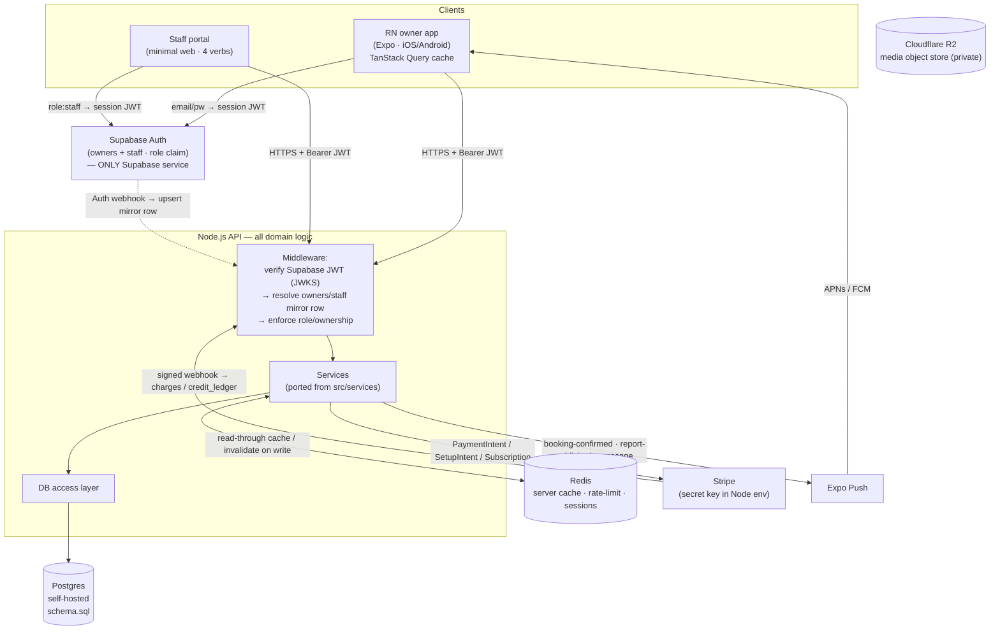
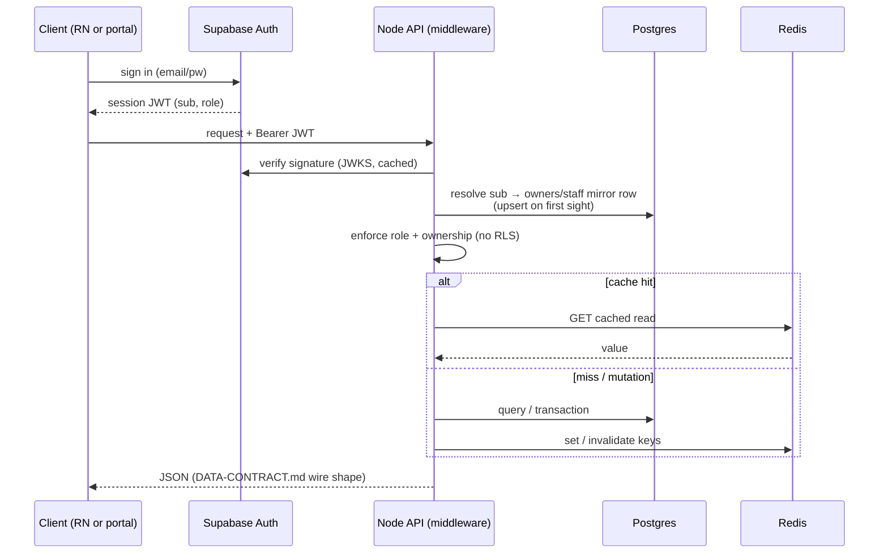
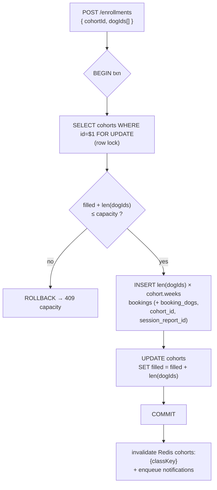
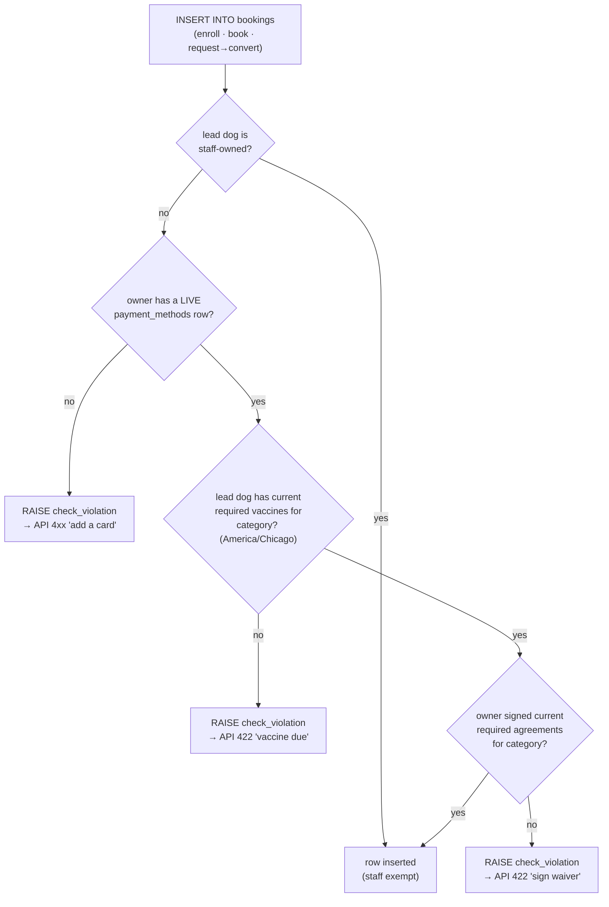

# DIAGRAMS.md — the entire Phase-3 backend, visual

The complete visual model of the NWA backend. Diagrams are **Mermaid** (text
source so they diff + version-control), authoritative against `schema.sql`.

## How to view this as a real (Visio-like) diagram

- **VSCode:** install the *Markdown Preview Mermaid Support* extension → open
  this file → Preview (⌘⇧V). Renders as boxes/connectors.
- **GitHub:** renders Mermaid natively in the file view — zero setup.
- **Export an image:** paste a block into <https://mermaid.live> → export
  SVG or PNG.
- **Edit it Visio-style / export `.vsdx`:** import a block into
  <https://draw.io> (diagrams.net) — *Arrange → Insert → Advanced → Mermaid*.
  draw.io is the closest free Visio analog and exports Visio `.vsdx`.

`schema.sql` is the source of truth for full columns/constraints; the ERD
below shows structure + keys + relationships (Visio "logical ERD" level).

---

## 1. System context / topology



---

## 2. Full entity-relationship diagram

Every table in `schema.sql`, grouped by domain. Attributes show PK/FK/UK +
load-bearing columns only (full columns + CHECKs + indexes live in `schema.sql`).

```mermaid
erDiagram
  %% ---- identity ----
  owners {
    uuid id PK
    uuid supabase_uid UK
    text email
    app_location location
    text external_ref
    record_source source
  }
  staff {
    uuid id PK
    uuid supabase_uid UK
    text name
    staff_role role
  }

  %% ---- dogs ----
  dogs {
    uuid id PK
    uuid owner_id FK
    uuid staff_owner_id FK
    uuid primary_vet_id FK
    boolean capacity_exempt
    text name
    date birthdate
    evaluation_status evaluation_status
    timestamptz expired_at
    text external_ref
    record_source source
  }
  audit_log {
    bigint id PK
    text table_name
    text row_pk
    text op
    jsonb before
    timestamptz at
  }
  vets {
    uuid id PK
    text name
    text phone
    text email
    text address
  }
  required_vaccines { text key PK
    text label
    service_category gates_categories }
  dog_vaccines      { uuid id PK
    uuid dog_id FK
    text requirement_key FK
    date expires_at }
  dog_medications   { uuid id PK
    uuid dog_id FK }
  dog_feeding       { uuid dog_id PK_FK
    text brand }
  dog_completed_classes { uuid id PK
    uuid dog_id FK
    group_class_key class_key }

  %% ---- group classes ----
  group_classes {
    group_class_key key PK
    integer price_per_dog_cents
    integer capacity
  }
  %% Day-6a (2026-05-20) — OR-prereq replaces the singular FK. Multiple
  %% rows per class_key = OR alternatives.
  class_prereq_options {
    uuid id PK
    group_class_key class_key FK
    group_class_key prereq_class_key FK
  }
  cohorts {
    uuid id PK
    group_class_key class_key FK
    location_key location
    timestamptz start_date
    integer capacity
    integer filled
  }

  %% ---- reports (R2: base + JSONB) ----
  reports {
    uuid id PK
    uuid dog_id FK
    uuid trainer_staff_id FK
    service_category category
    report_program program
    jsonb results
    jsonb content
    text external_ref
  }
  media_assets {
    uuid id PK
    uuid owner_id FK
    uuid dog_id FK
    uuid report_id FK
    media_kind kind
    media_purpose purpose
    text object_key
    jsonb derivatives
  }

  %% ---- bookings + requests (R1 multi-dog) ----
  bookings {
    uuid id PK
    uuid owner_id FK
    uuid lead_dog_id FK
    service_category category
    booking_status status
    timestamptz scheduled_at
    location_key location
    timestamptz cancel_deadline_at
    boolean cancel_forfeited
    uuid cohort_id FK
    uuid report_id FK
    uuid session_report_id FK
    text external_ref
  }
  booking_dogs {
    uuid booking_id PK_FK
    uuid dog_id PK_FK
    boolean is_lead
    booking_attendance attendance
    uuid checked_in_by_staff_id FK
  }
  after_school_optins {
    uuid id PK
    uuid booking_id FK
    service_category booking_category
    uuid dog_id FK
    uuid owner_id FK
    integer school_day_count
  }
  pending_requests {
    uuid id PK
    uuid owner_id FK
    uuid lead_dog_id FK
    service_category category
    request_status status
    uuid approved_by_staff_id FK
    uuid converted_booking_id FK
    text external_ref
  }
  pending_request_dogs { uuid request_id PK_FK
    uuid dog_id PK_FK }
  pending_request_preferred_dates { uuid request_id PK_FK
    smallint ordinal PK
    timestamptz preferred_at }

  %% ---- availability ----
  day_capacity {
    location_key location PK
    date date PK
    integer school_openings
    integer daycare_openings
  }

  %% ---- credits + payments ----
  credit_packages {
    text key PK
    booking_mode mode
    integer credits
    integer price_cents
  }
  credit_ledger {
    uuid id PK
    uuid dog_id FK
    booking_mode mode
    integer delta
    ledger_reason reason
    uuid booking_id FK
    text package_key FK
    uuid charge_id FK
  }
  stripe_customers {
    uuid owner_id PK_FK
    text stripe_customer_id UK
  }
  payment_methods {
    uuid id PK
    uuid owner_id FK
    text stripe_payment_method_id UK
    boolean is_default
  }
  charges {
    uuid id PK
    uuid owner_id FK
    text stripe_payment_intent_id UK
    integer amount_cents
    charge_status status
    charge_purpose purpose
    uuid booking_id FK
  }
  memberships {
    uuid id PK
    uuid owner_id FK
    uuid dog_id FK
    booking_mode mode
    text stripe_subscription_id UK
  }
  refunds {
    uuid id PK
    uuid owner_id FK
    uuid charge_id FK
    uuid booking_id FK
    integer amount_cents
    refund_status status
  }
  service_rates {
    uuid id PK
    service_category category
    location_key location
    integer amount_cents
    rate_unit unit
    date effective_from
    date effective_to
  }

  %% ---- agreements (waivers) ----
  agreement_documents {
    text key PK
    integer current_version
    boolean required
    service_category applies_to
  }
  agreement_signatures {
    uuid id PK
    uuid owner_id FK
    text document_key FK
    integer version
    timestamptz signed_at
  }

  %% ---- idempotency (transport; never-delete exception) ----
  idempotency_keys {
    text key PK
    uuid owner_id FK
    text endpoint
    integer response_status
  }

  %% ---- messaging ----
  threads {
    uuid id PK
    uuid owner_id FK
    uuid participant_staff_id FK
    thread_category category
    text external_ref
  }
  thread_dogs { uuid thread_id PK_FK
    uuid dog_id PK_FK }
  messages {
    uuid id PK
    uuid thread_id FK
    sender_kind sender_kind
    uuid sender_owner_id FK
    uuid sender_staff_id FK
    timestamptz read_at
  }

  %% ---- events ----
  event_series {
    uuid id PK
    text name
    text cadence
    boolean is_active
  }
  events {
    uuid id PK
    text name
    timestamptz starts_at
    integer capacity
  }
  event_rsvps {
    uuid id PK
    uuid event_id FK
    uuid owner_id FK
  }
  event_rsvp_dogs { uuid rsvp_id PK_FK
    uuid dog_id PK_FK }

  %% ---- notifications / announcements / push ----
  invoices {
    uuid id PK
    uuid owner_id FK
    integer amount_cents
    invoice_status status
    charge_purpose purpose
    uuid booking_id FK
    uuid cohort_id FK
    uuid request_id FK
    uuid payment_method_id FK
    uuid paid_charge_id FK
  }
  scheduled_notifications {
    uuid id PK
    uuid owner_id FK
    notification_type type
    text trigger
    timestamptz scheduled_for
    scheduled_status status
    uuid booking_id FK
  }
  notifications {
    uuid id PK
    uuid owner_id FK
    notification_type type
    text deep_link_path
    uuid sender_staff_id FK
  }
  notification_dogs { uuid notification_id PK_FK
    uuid dog_id PK_FK }
  announcements {
    uuid id PK
    announcement_category category
    app_location target_location
    boolean is_pinned
  }
  device_tokens {
    uuid id PK
    uuid owner_id FK
    text expo_push_token
    text platform
  }

  owners ||--o{ dogs : owns
  owners ||--o{ media_assets : uploads
  dogs ||--o{ media_assets : has
  reports ||--o{ media_assets : has
  owners ||--o{ bookings : "owns (denorm)"
  owners ||--o{ pending_requests : submits
  owners ||--o{ threads : participates
  owners ||--o{ payment_methods : has
  owners ||--o{ charges : billed
  owners ||--o{ memberships : subscribes
  owners ||--o{ notifications : receives
  owners ||--o| stripe_customers : maps
  owners ||--o{ event_rsvps : rsvps
  owners ||--o{ device_tokens : registers
  owners ||--o{ refunds : refunded
  owners ||--o{ agreement_signatures : signs
  owners ||--o{ idempotency_keys : "dedupes (transport)"

  staff ||--o{ reports : authors
  staff ||--o{ bookings : trains
  staff ||--o{ pending_requests : approves
  staff ||--o{ threads : participant
  staff ||--o{ messages : sends

  vets ||--o{ dogs : "primary vet"
  required_vaccines ||--o{ dog_vaccines : "satisfied by"
  dogs ||--o{ dog_vaccines : has
  dogs ||--o{ dog_medications : has
  dogs ||--|| dog_feeding : has
  dogs ||--o{ dog_completed_classes : completed
  dogs ||--o{ booking_dogs : on
  dogs ||--o{ pending_request_dogs : on
  dogs ||--o{ reports : about
  dogs ||--o{ credit_ledger : "credits for"
  dogs ||--o{ thread_dogs : about
  dogs ||--o{ event_rsvp_dogs : attends
  dogs ||--o{ notification_dogs : about
  dogs ||--o{ memberships : covered

  group_classes ||--o{ cohorts : runs
  group_classes ||--o{ dog_completed_classes : credited
  group_classes ||--o{ class_prereq_options : "has prereq options (OR)"
  class_prereq_options }o--|| group_classes : "satisfies"
  cohorts ||--o{ bookings : "weekly rows"

  reports ||--o{ bookings : "session_report_id (cohort)"
  bookings ||--o{ booking_dogs : includes
  bookings ||--o{ after_school_optins : "after-school (day-school only)"
  dogs ||--o{ after_school_optins : opts-in
  bookings ||--o| reports : "report_id (1:1)"
  bookings ||--o{ credit_ledger : debits
  bookings ||--o{ charges : "pays (payg)"

  pending_requests ||--o{ pending_request_dogs : includes
  pending_requests ||--o{ pending_request_preferred_dates : ranks
  pending_requests ||--o| bookings : "converted_booking_id"

  credit_packages ||--o{ credit_ledger : grants
  charges ||--o{ credit_ledger : "funds (purchase)"
  charges ||--o{ refunds : "refunded by"
  bookings ||--o{ refunds : "cancellation refund"
  agreement_documents ||--o{ agreement_signatures : "signed at version"

  threads ||--o{ thread_dogs : about
  threads ||--o{ messages : contains
  event_series ||--o{ events : occurrences
  events ||--o{ event_rsvps : has
  event_rsvps ||--o{ event_rsvp_dogs : includes
  notifications ||--o{ notification_dogs : about
  owners ||--o{ scheduled_notifications : queued
  bookings ||--o{ scheduled_notifications : triggers
  owners ||--o{ invoices : owes
  bookings ||--o| invoices : "pay-later"
  cohorts ||--o{ invoices : "pay-later"
  pending_requests ||--o| invoices : "B&T pay-later"
```

> `dog_credit_balance` is a SQL **view** (`SUM(credit_ledger.delta)` per
> dog+mode), not a table — not drawn. Redis caches its result.

---

## 3. Auth + request lifecycle



---

## 4. Load-bearing transaction — group-class enrollment

Representative of the one-transaction-or-nothing boundaries (request
approval and credit-debited booking follow the same shape — see the
transaction-contract notes at the bottom of `schema.sql`).



---

## 5. Booking-creation gates (3 BEFORE-INSERT trigger floors)

Every `INSERT INTO bookings` passes three unbypassable DB triggers before the
row exists (in addition to the API's friendlier pre-checks). All exempt
staff-owned dogs and check the lead dog/owner; the API enforces the full set
across all `booking_dogs`. Identical pattern, three concerns.



> Cancellation mirror: `POST /bookings/:id/cancel` sets `cancelled_at` +
> `cancel_forfeited = now() > cancel_deadline_at`. Forfeited → no refund;
> within window → `credit_ledger` +delta (credit bookings) **or** a `refunds`
> row + Stripe refund (money bookings). See `schema.sql` txn-contract notes.

---

When `schema.sql` changes, update the ERD here in the same commit — the two
are a pair; drift between them is a review-blocking issue.
